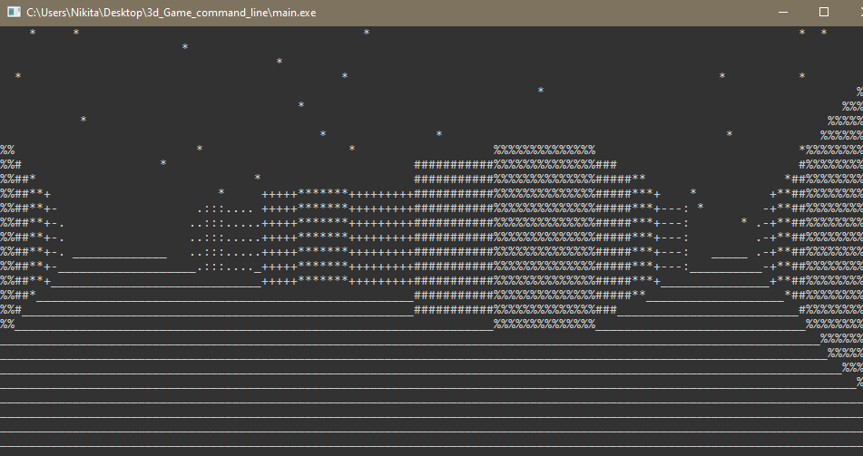
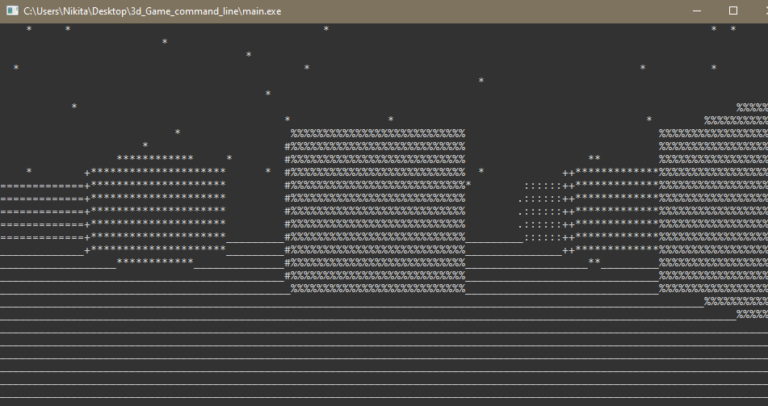
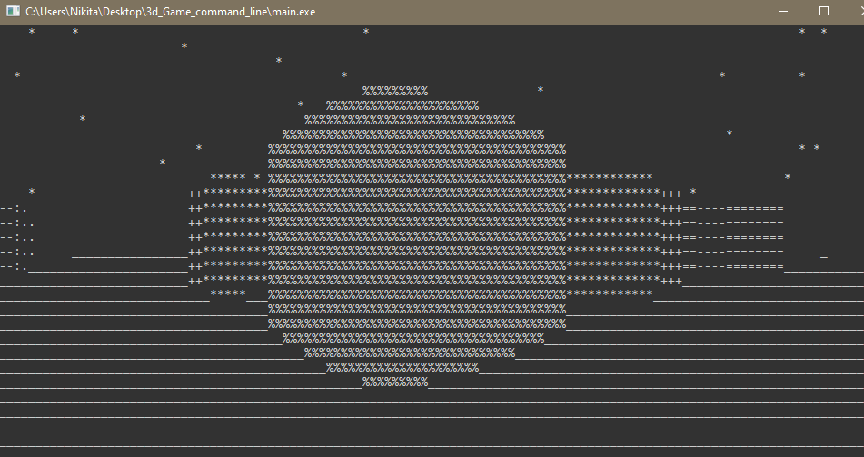
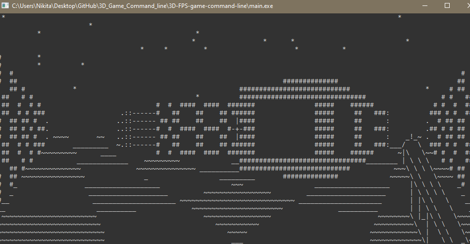
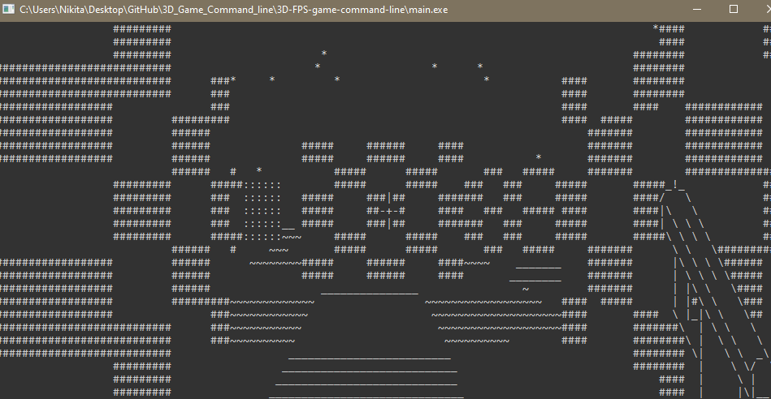
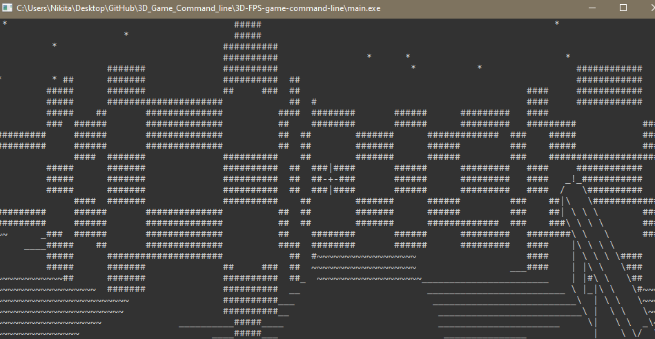
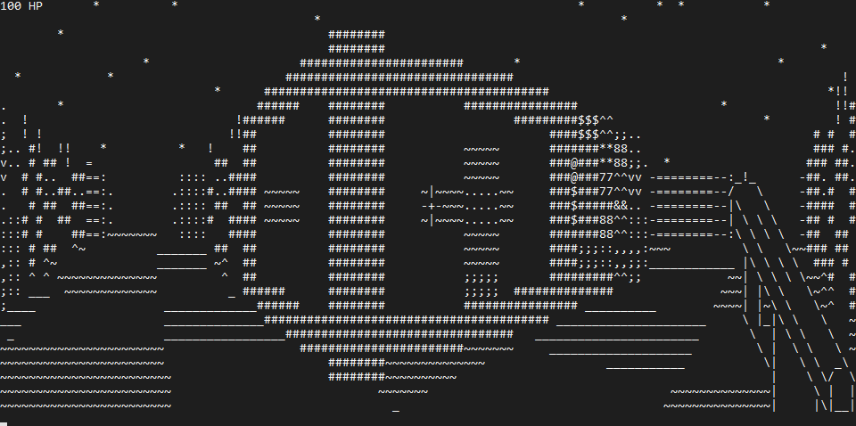
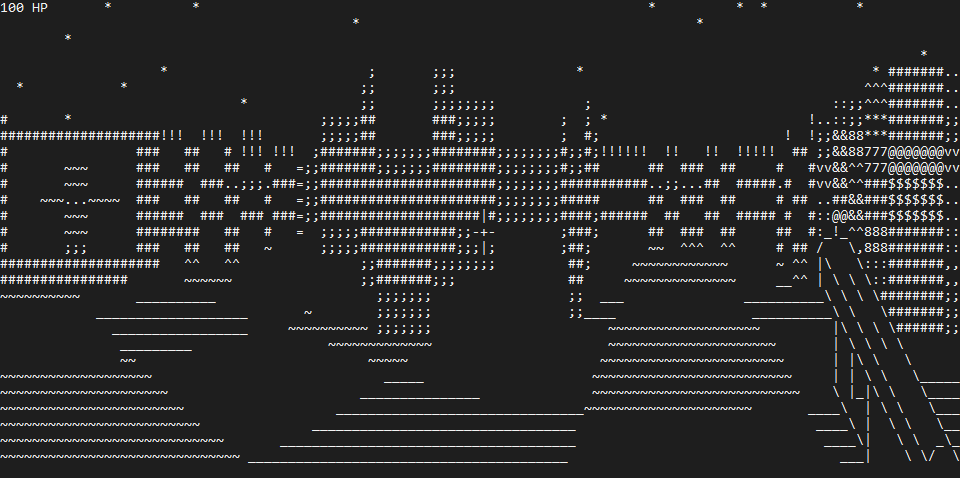
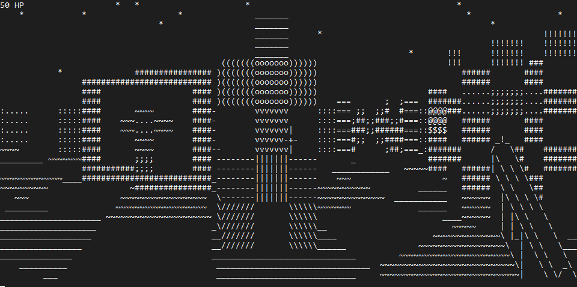

## 3D-FPS-game-command-line
### Introduction

This is a pseudo 3d game written in C programming language, and running on the windows command line.
Engine of this game uses RayCasting technology to draw lines onscreen. It creates an illusion of a 3 dimensional game, but really
it is only a 2d map.

### Installation (Windows 10)

It works stably on the __Windows 10__ command line. In earlier OS versions, updating the command line may be slow.

- #### Step 1 - clone repository
First of all you need to clone repository. The following command to do it:

    git clone https://github.com/Nikita-bunikido/3D-FPS-game-command-line.git

- #### Step 2 - open .exe file
In repository you need to find file "NSHOOT.exe",  and run it.

- #### Step 3 - setting up multiplayer
If you want to play online with your friend, you need to setup a multiplayer.
**Your computer and a friend's computer must necessarily be connected to the same local network to play online.** 
Then on your computer in menu of the game you need to choose _'s' - Server_. And your friend need to choose _'c' - Client_. Your friend need to know your IPv4 adress. If you don't know it, open the _command line_ (_Win_ + _R_), write _cmd_ and paste the command:

    ipconfig

Then write this adress on client and enjoy!

If you want to play _offline_ write _'o' - Offline_ in the menu.

### Management

Basic management:
W | A | S | D | SPACE
--|:-:|:-:|:-:|:----:
go ahead | go left | go back | go right | shoot|

---

### Version 1.0

__First__ version of game.

Added:

- Basic Ray-Casting algorithm
- Color depth
- Management
- Sky with stars
- Basic floor

Here is some **demonstration** of how does it work:

Ray-Casting algorithm:

Working depth of color:

Randomly generated stars:

---

### Version 2.0

Second version of game.

Added:

- Textured walls
- Volumetric 3D floor
- Weapon layout
- More than one texture on map
- Bugs fixed

Here is some **demonstration** of how does it work:

5x5 textured walls:

Weapon overlay:

Working 3D floor:

---

### Version 3.0

**LAST** version of game.

Now you can play with your friends. In version 3.0 added a local network multiplayer.

Added:
- Local network multplayer
- More textures on walls
- Menu
- Reworked weapon
- Fixed bugs

Here is some **demonstration** of how does it work:

7x7 textures:

---

ASCII weapon. (Probel to shoot):

---

Multiplayer test:

**Enjoy!**
